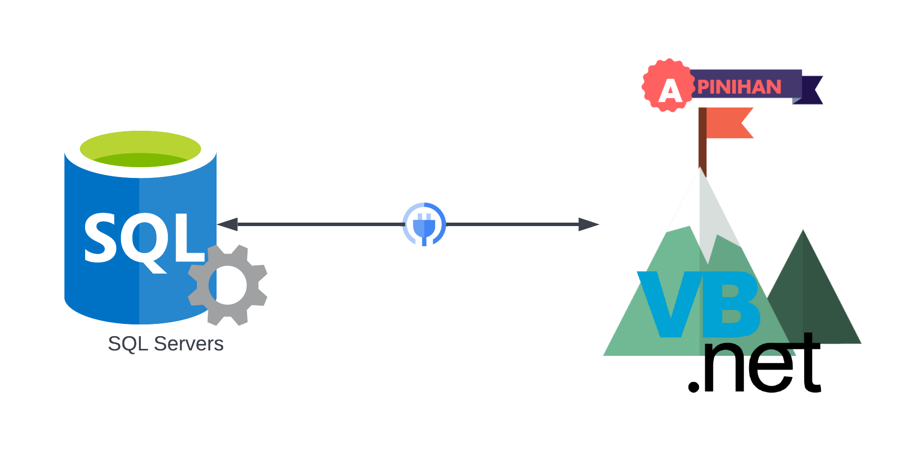
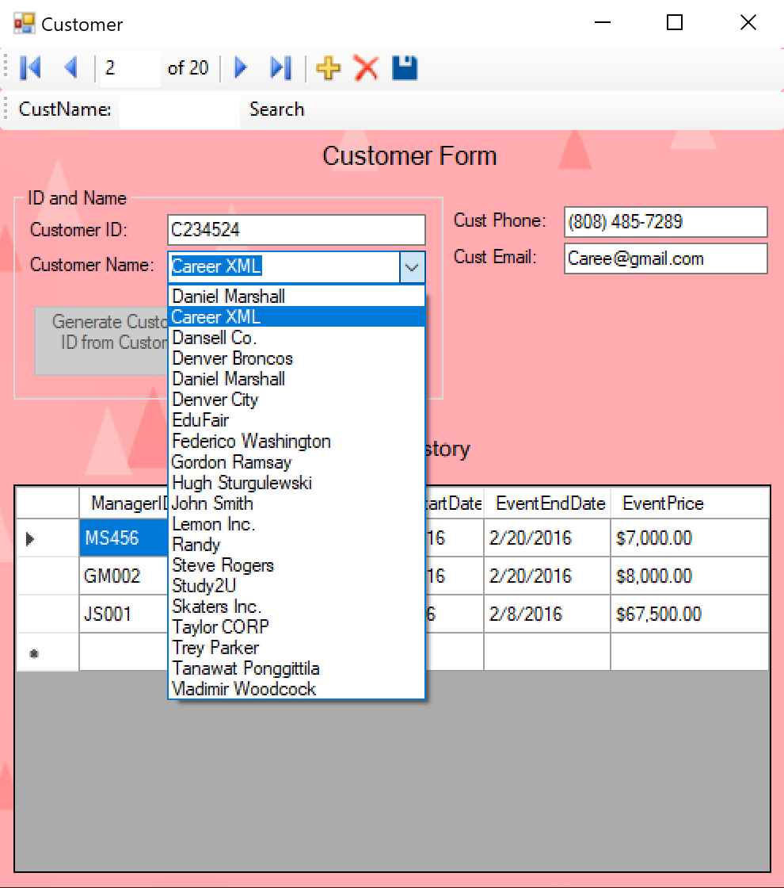
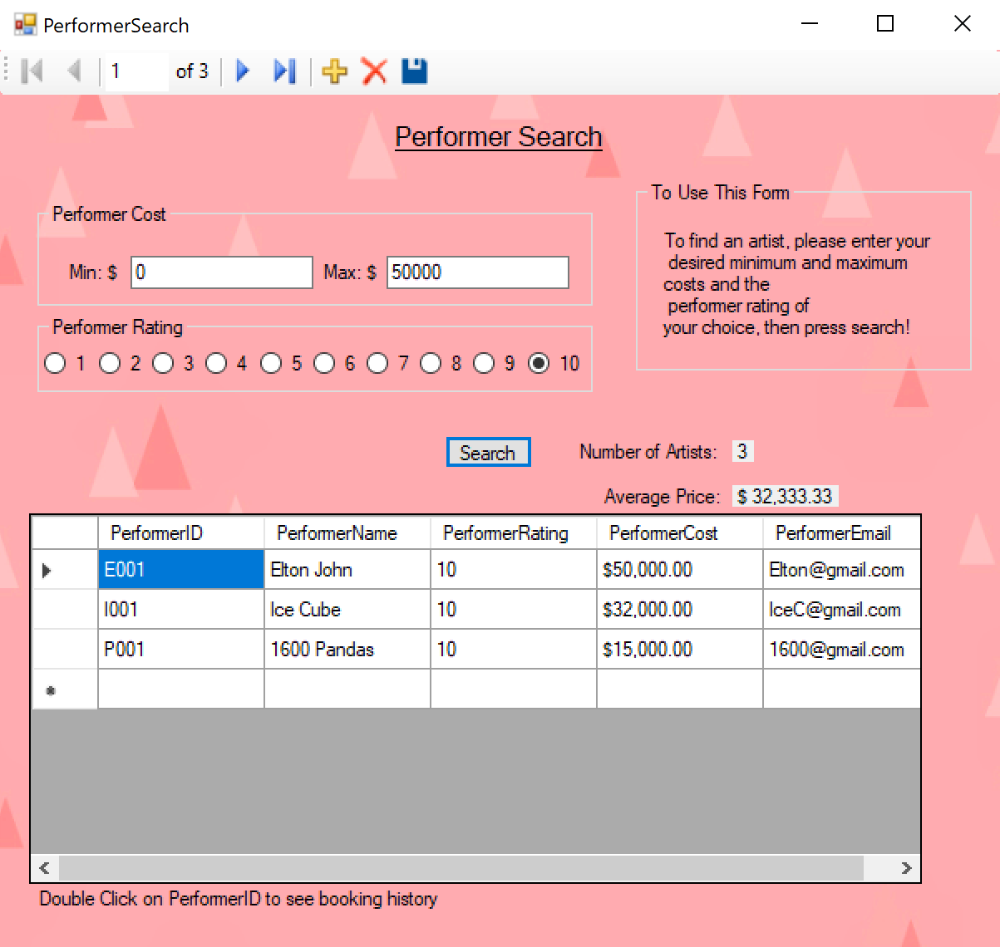
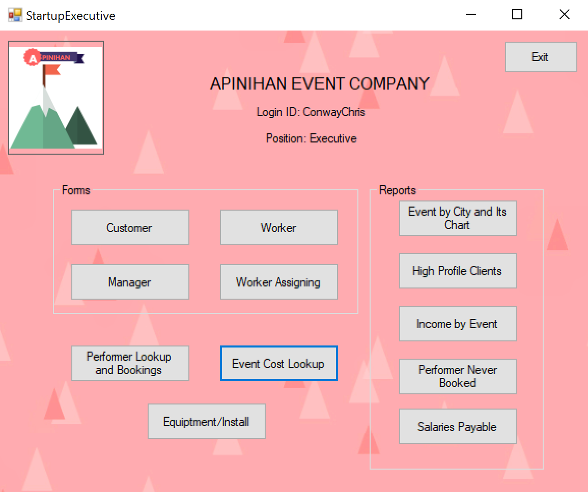
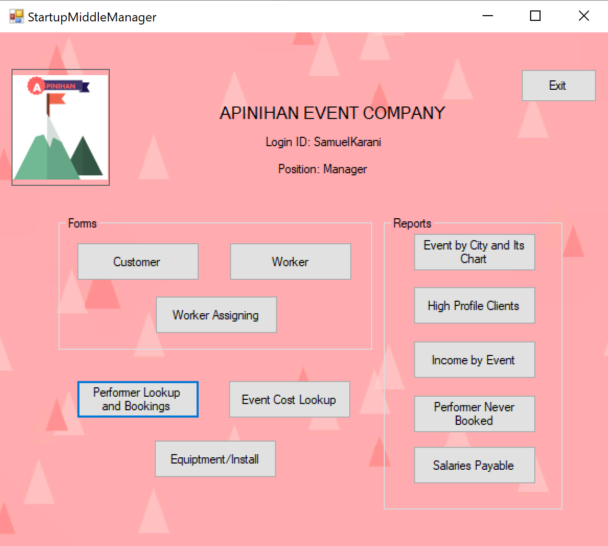
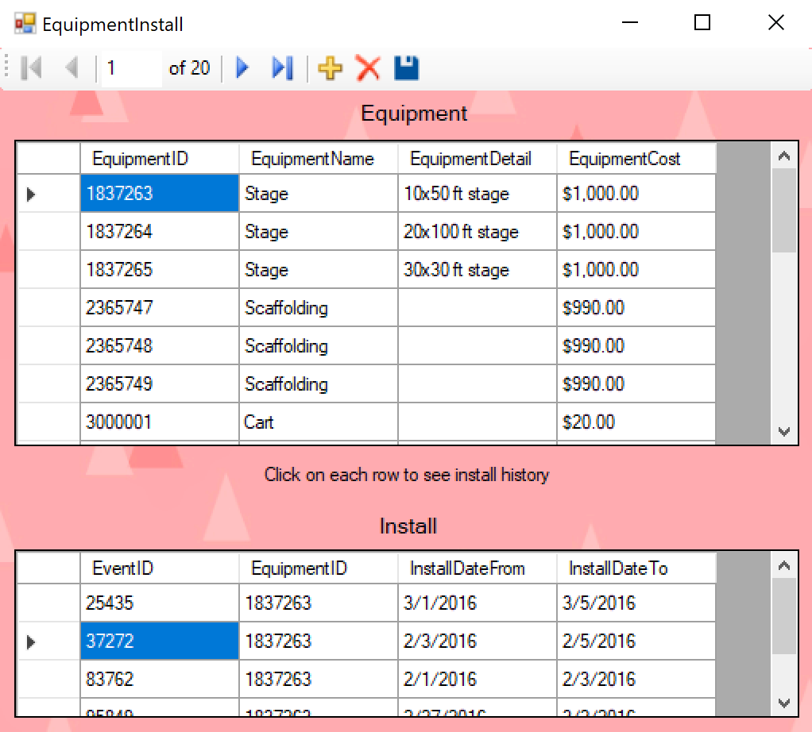
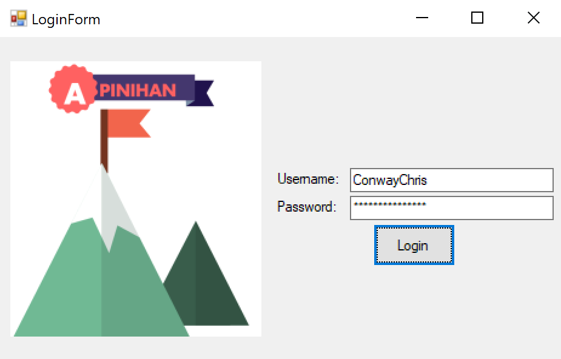

# Apinihan
Apinihan is an ERP software for event management

# Requires
1. SQL Server for all transactional requests (through VB.NET data adapters). For viewing purpose, it is not needed
2. Legacy build tool... VB.NET 2012. 

# Getting Started with Mock Data
1. Mock data: run mockdb/BuildApinihan.sql.
2. Mock usernames and passwords are in scripts/scripts/BuildApinihanCreateUsernamePassword.sql
3. Useful scripts including sprocs and analytical SQLs in scripts

# SSRS (Reporting Service)
SSRS capabilities have been taken out of this version. I find no one having SSRS license...

# Screenshots

  
show screenshots

  
  
  
  
  
  

